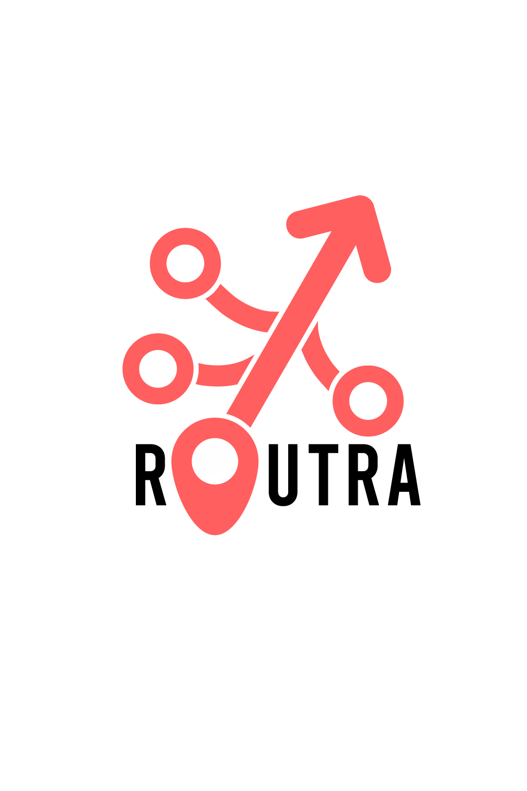

# 🚀 Routra

Routra is an AI-powered roadmap generator for startups. Describe your startup idea in natural language, and Routra transforms it into a clean, visual roadmap that evolves with your product. Simple. Smart. Scalable.

 <!-- Replace with actual path if hosted -->

---

## ✨ Features

- 🧠 AI chatbox that converts startup ideas into actionable roadmaps
- 📌 Visual roadmap editor with drag-and-drop goals (coming soon)
- 🎨 Responsive modern UI with light/dark theme toggle
- 🌌 Dynamic constellation-style animated background
- 🔁 Placeholder suggestions rotate every few seconds
- 💡 Built for creators, founders, and product teams

---

## 🛠 Tech Stack

- **Frontend:** React + Vite + TypeScript
- **Styling:** TailwindCSS + Custom animations
- **Theme Support:** Light/Dark mode toggle with class-based transitions
- **Graphics:** SVG + Canvas animations
- **Hosting:** GitHub Pages / Vercel / Netlify (your choice)

---

## ⚙️ Getting Started

### 1. Clone the repo

```bash
git clone https://github.com/TThimmesh/routra.git
cd routra
