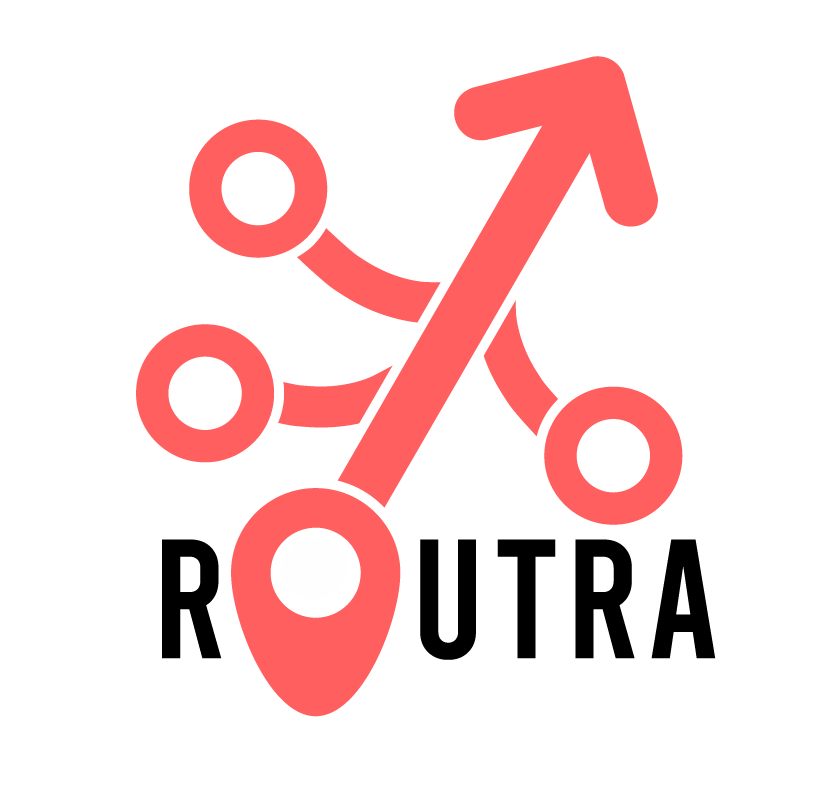
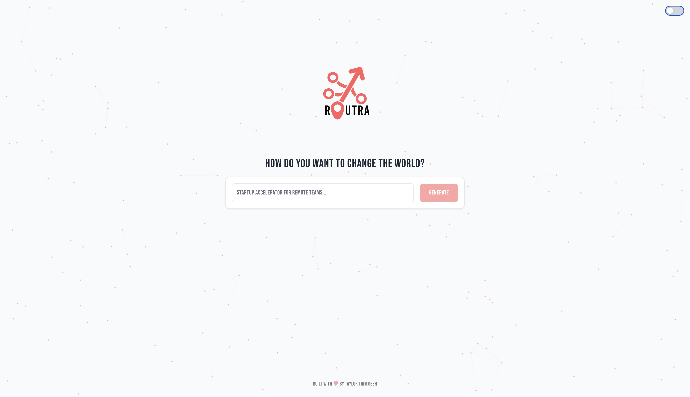
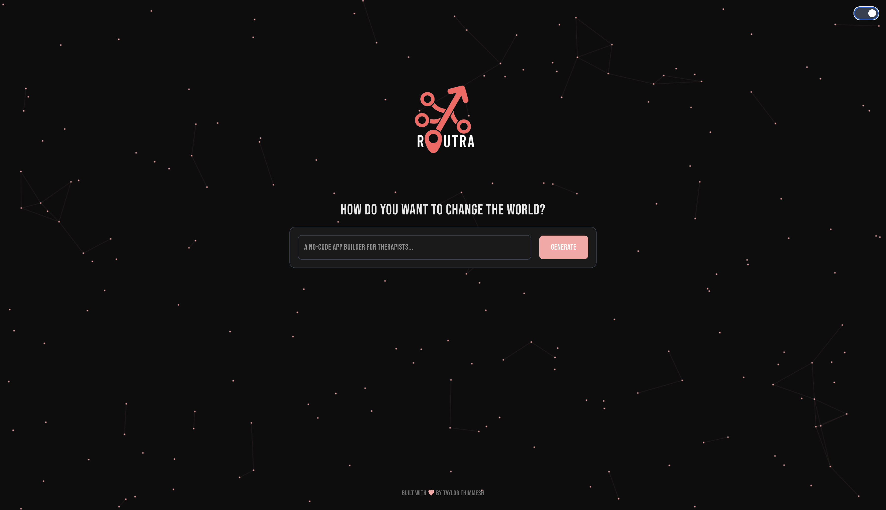

# 🚀 Routra

Routra is an AI-powered roadmap generator for startups. Describe your startup idea in natural language, and Routra transforms it into a clean, visual roadmap that evolves with your product. Simple. Smart. Scalable.

---

## ✨ Features

- 🧠 AI chatbox that converts startup ideas into actionable roadmaps
- 📌 Visual roadmap editor (MVP) with drag-and-drop phases and color customization
- 🎨 Responsive modern UI with light/dark theme toggle
- 💡 Built for creators, founders, and product teams

---

## 📍 Project Roadmap

You can view the full roadmap [here](./ROADMAP.md).

---

## 🛠 Tech Stack

- **Frontend:** React + Vite + TypeScript
- **Styling:** TailwindCSS + Custom animations
- **Theme Support:** Light/Dark mode toggle with smooth transitions
- **Graphics:** SVG + Canvas animations
- **Hosting:** GitHub Pages / Vercel / Netlify
- **AI Integration:** Hugging Face API / Local Ollama LLM backend

---

## 🌗 Dark Mode

Routra supports a smooth light ↔ dark transition. Your theme preference is saved and synced with your system theme. Switch modes using the toggle in the top right corner.

---

## 📸 Screenshots

| Light Mode | Dark Mode |
|------------|-----------|
|  |  |

---

## 🧪 Coming Soon

- User authentication
- Save/share personal roadmaps
- AI-generated task breakdowns and milestones
- Export roadmaps to Notion / Trello / PDF
- Improved roadmap layout and auto-organizing mind map editor

---

## 👥 Team

### 🧑‍💻 Taylor Thimmesh  
**Role:** Founder & Lead Developer  
🌐 [thimmesh.tech](https://thimmesh.tech)  
📬 [LinkedIn](https://www.linkedin.com/in/taylorthimmesh/)  
🐦 [@wasdtaylor](https://twitter.com/wasdtaylor)

### 🎨 Luke Hutchison  
**Role:** Lead Graphic Artist  
🎨 Responsible for brand identity, UI styling, logo design, and visual direction.  
📬 [LinkedIn](https://www.linkedin.com/in/luke-hutchison-737237310/)

### 🎨 Randall Manayao  
**Role:** Visual Design Assistant  
🎨 Works alongside the design team to bring Routra’s visual identity to life through UI elements, brand assets, and layout support.  
📬 [LinkedIn](https://www.linkedin.com/in/randall-manayao-b80648311/)

### 📈 Simas Gurskis  
**Role:** Head of Marketing  
📈 Responsible for shaping Routra’s brand voice, executing growth strategies, and leading marketing efforts to drive user acquisition, community engagement, and product visibility.  
📬 [LinkedIn](https://www.linkedin.com/in/simas-gurskis-b025b1362/)

---
