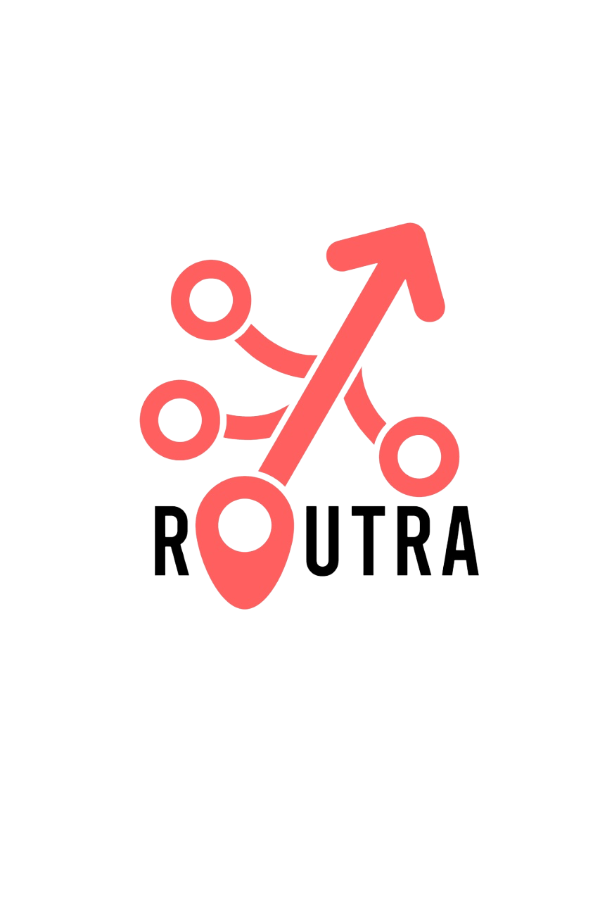

# 🚀 Routra

Routra is an AI-powered roadmap generator for startups. Describe your startup idea in natural language, and Routra transforms it into a clean, visual roadmap that evolves with your product. Simple. Smart. Scalable.



---

## ✨ Features

- 🧠 AI chatbox that converts startup ideas into actionable roadmaps
- 📌 Visual roadmap editor with drag-and-drop goals (coming soon)
- 🎨 Responsive modern UI with light/dark theme toggle
- 🌌 Dynamic constellation-style animated background
- 🔁 Placeholder suggestions rotate every few seconds
- 💡 Built for creators, founders, and product teams

---

## 🛠 Tech Stack

- **Frontend:** React + Vite + TypeScript
- **Styling:** TailwindCSS + Custom animations
- **Theme Support:** Light/Dark mode toggle with smooth transitions
- **Graphics:** SVG + Canvas animations
- **Hosting:** GitHub Pages / Vercel / Netlify

---

## ⚙️ Getting Started

### 1. Clone the repo

```bash
git clone https://github.com/your-username/routra.git
cd routra
```

### 2. Install dependencies

```bash
npm install
```

### 3. Start the dev server

```bash
npm run dev
```

App will be running on: `http://localhost:5173` (or as shown in terminal)

---

## 🌗 Dark Mode

Routra supports a smooth light ↔ dark transition. Your theme preference is saved and synced with your system theme. Switch modes using the toggle in the top right corner.

---

## 📸 Screenshots

| Light Mode | Dark Mode |
|------------|-----------|
|  |  |

> Add your screenshots to the `screenshots/` folder and update the image paths above.

---

## 🧪 Coming Soon

- User authentication
- Save/share roadmaps
- AI-generated milestones and task breakdowns
- Export to Notion / Trello / PDF

---

## 🧑‍💻 Author

**Taylor Thimmesh**  
🌐 [thimmesh.tech](https://thimmesh.tech)  
📬 [LinkedIn](https://www.linkedin.com/in/taylorthimmesh/)  
🐦 [@yourhandle](https://twitter.com/wasdtaylor)
